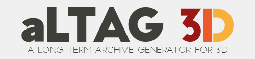

Introduction
============

À propos de aLTAG3D
-------------------

aLTAG3D permet de générer des archives de vos projets 3D, compatible avec le
service d'archivage du CINES et du Consortium 3D.

Le fonctionnement d'aLTAG3D cherche à être le plus automatique possible, et donc
à réduire le plus possible le nombre d'informations que vous aurez à remplir manuellement.

aLTAG3D utilise un système de graphes pour permettre un remplissage plus intuitifs
des données d'archivage.

.. ATTENTION::
  Ceci est la documentation développeur du logiciel aLTAG3D, si vous cherchez la
  documentation utilisateur, elle est disponible ici_ !

.. _ici: http://altag3d-userdoc.readthedocs.io/fr/latest/
