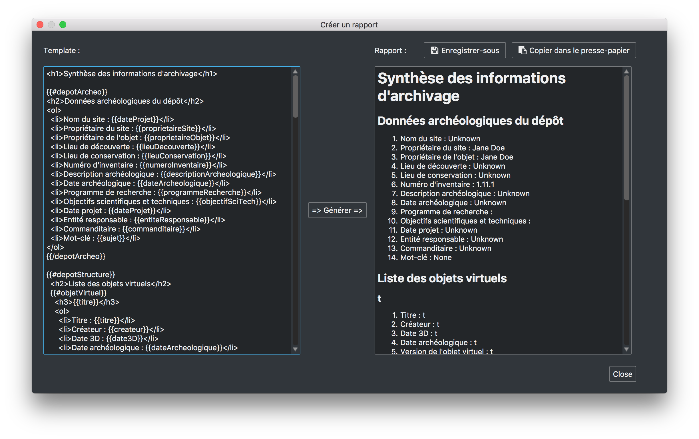

Création d'un template de rapport
=================================

aLTAG3D utilise le moteur de templates **Mustache** dont la documentation est
disponible ici_. N'importe quel template mustache utilisant comme mots-clés les noms
utilisés dans le XSD est donc compatible avec notre système de rapport. Ce
template pourra alors être écrit en LaTeX, HTML, MD, TXT, etc.

Utilisation de *Mustache*
-------------------------

*Mustache* fonctionne en remplaçant  des mots-clés dans un template par des
valeurs issues d'un jeu de données. Il est dit « Logic-less » car il ne dispose
d'aucun mot-clé spécifique (if, else, for, etc.), il utilise seulement les
mots-clés présents dans vos données pour fonctionner.

Exemple de fonctionnement :

.. literalinclude:: _static/files/example.json
   :language: json
   :caption: Données \:
   :linenos:

.. literalinclude:: _static/files/example_template.html
   :language: html
   :caption: Template \:
   :linenos:

.. literalinclude:: _static/files/example_result.html
   :language: html
   :caption: Résultat \:
   :linenos:

Ici le mot-clé **{{#objets}}** joue le rôle d'une condition **if** et d'une boucle **for**.

Pour plus d'informations concernant la syntaxe et le fonctionnement de *Mustache*,
la documentation est disponible ici_.

Mots-clés spécifiques à aLTAG3D
-------------------------------

Dans aLTAG3D, les données (et donc les mots-clés) sont directement extraites de
l'arbre de votre projet. La partie template est personnalisable lors de la
création d'un rapport par un simple copier/coller dans la partie gauche
(template) de la fenêtre.

  Exemple de création d'un rapport

L'ensemble des mots-clés et de leurs labels (i. e. : le texte qui apparaît dans
aLTAG3D à la place du mot-clé) est disponible ci-dessous ou bien dans le fichier XSD.

================================  ========================================
        Mot-clé                                    Label
================================  ========================================
depotArcheo                       Données archéologiques du dépôt
dateProjet                        Date projet
descriptionArcheologique          Description archéologique
entiteResponsable                 Entité responsable
proprietaireObjet                 Propriétaire de l'objet
proprietaireSite                  Propriétaire du site
siteNom                           Nom du site
sujet                             Mot-clé
commanditaire                     Commanditaire
dateArcheologique                 Date archéologique
lieuConservation                  Lieu de conservation
lieuDecouverte                    Lieu de découverte
numeroInventaire                  Numéro d'inventaire
objectifsScientifiquesTechniques  Objectifs scientifiques et techniques
paradonnees                       Fichier de paradonnées
programmeRecherche                Programme de recherche
depotStructure                    Structure du dépôt
nombreFichiers                    Nombre de fichiers
tailleProjet                      Taille du projet
structureDocument                 Structure du document
objetVirtuel                      Objet virtuel
createur                          Créateur
date3D                            Date 3D
objetVirtuelVersion               Version de l'objet virtuel
titre                             Titre
description                       Description
note                              Note
vignette                          Vignette
maillage                          Maillage
nombrePolygones                   Nombre de polygones
nomMaillage                       Nom du maillage
cheminFichier                     Chemin du fichier
dateFichier                       Date du fichier
formatFichier                     Format du fichier
compression                       Compression
empreinteOri                      Empreinte ORI
encodage                          Encodage
structureFichier                  Structure du fichier
fichier3DGeometrie                Fichier 3D géométrie
axeOrientation                    Axe orientation
axeVertical                       Axe vertical
uniteMesure                       Unité de mesure
logicielTraitement                Logiciel de traitement
Dimension_x                       Dimension X
Dimension_y                       Dimension Y
Dimension_z                       Dimension Z
fichier3DTexture                  Fichier 3D texture
typeTexture                       Type de texture
groupeSource                      Groupe de fichiers sources
fichierArchive                    Fichier d'archive
editeur                           Editeur
droits                            Droits
source                            Source
contributeur                      Contributeur
typeRessource                     Type de ressource
fichierDonneesVolumiques          Fichier de données volumiques
marqueCapteur                     Marque du capteur
modeleCapteur                     Modèle du capteur
profondeurStockeeVoxel            Profondeur stockée du voxel
profondeurUtiliseeVoxel           Profondeur utilisée du voxel
resolution                        Résolution
fichierLasergrammetrie            Fichier de lasergrammétrie
nombrePoints                      Nombre de points
texture                           Texture
systemCoordonneesXY               Système de coordonnées XY
systemCoordonneesZ                Système de coordonnées Z
fichierParadonnees                Fichier de paradonnées
langue                            Langue
fichierPhotogrammetrie            Fichier de photogrammétrie
pointTopo                         Point topo
exif                              EXIF
geoTag                            Geo tag
================================  ========================================

.. _ici: https://mustache.github.io/mustache.5.html
